## 环境

> 系统：Windows 10
> 引擎：Unity 2017.2.1f1

## 目的
> 通过实例了解lCamera层级控制

## 实例
（1-1）
 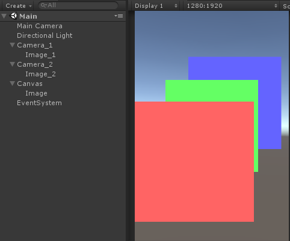

（1-2）
 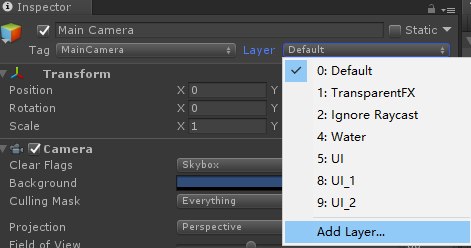

（1-3）
 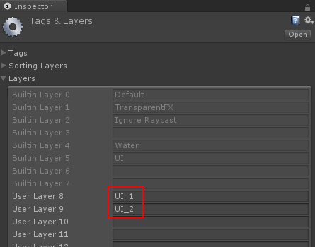
 
（1-4）
 

（1-5）
 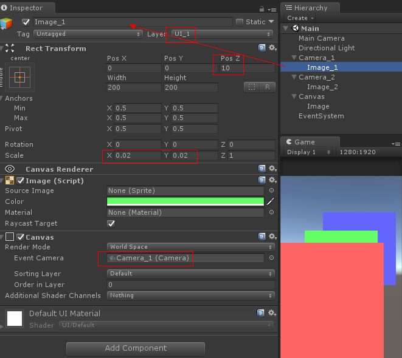

（1-6）
 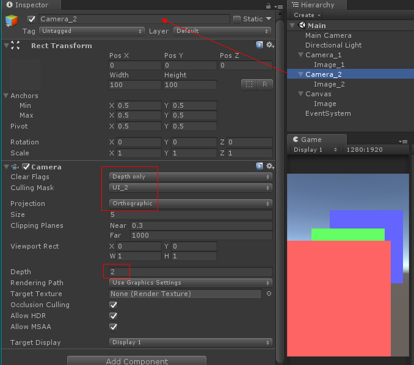

（1-7）
 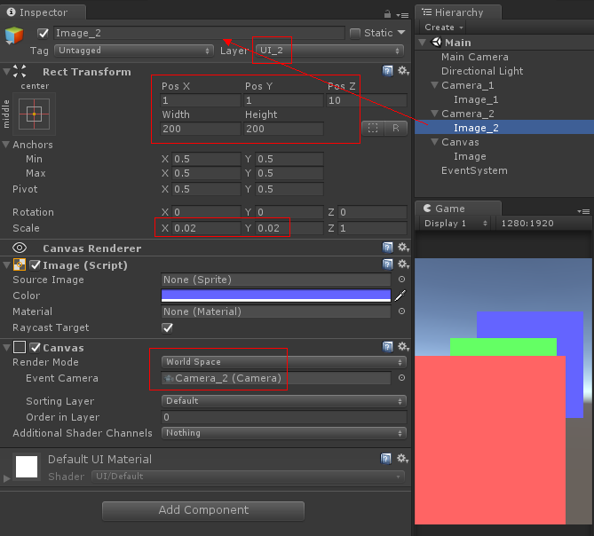

（1-8）
 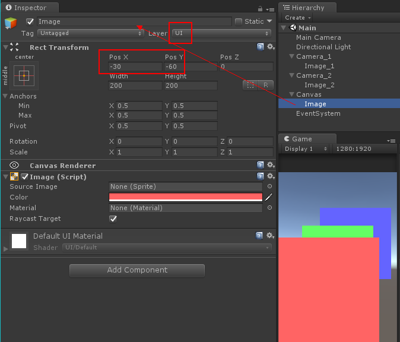

（2）
 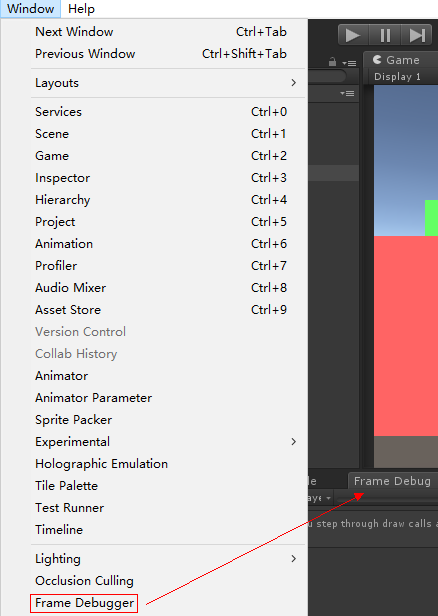

（3-1）
 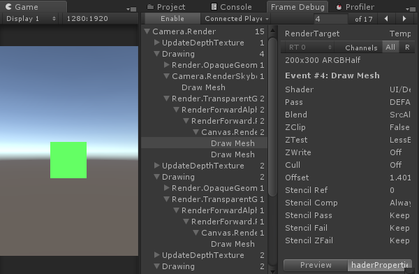

（3-2）
 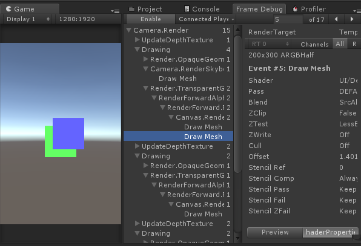

（3-3）
 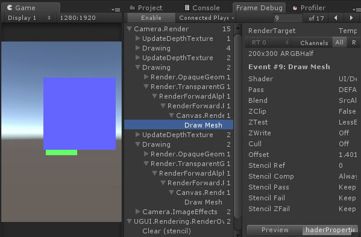

（3-4）
 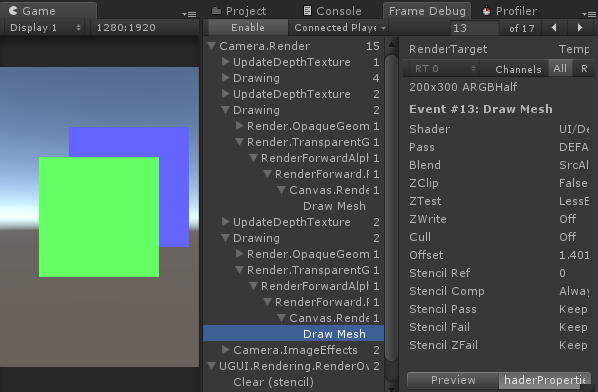

（3-5）
 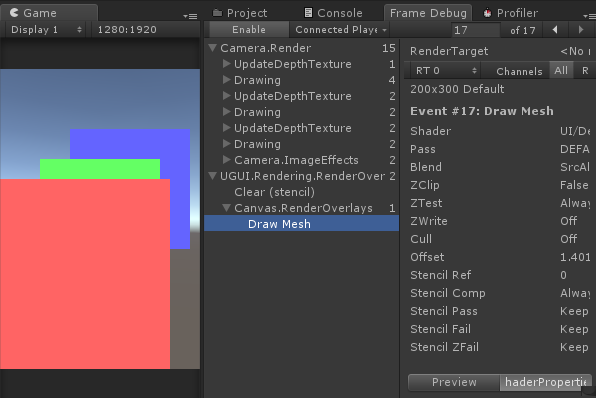

以上简单回顾。

## 参考资料：

无