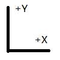
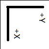
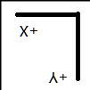
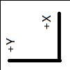
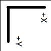
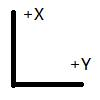
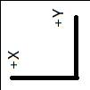
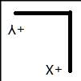

1D数学，一条轴，X轴；

可以任意转动，随意在各种空间中自由变换。

2D数学，两条轴，X轴和Y轴；

引用书上说法，有两种情况：
| 形式 | 0 | 90 | 180 | 270 |
| :--: | :--: | :--: | :--: | :--: |
| 标准形式 |  |  |  |  |
|  非标准形式  |    |    |    |    |

标准形式与非标准形式的四种情况，都是同方向（顺时针/逆时针）同时转动两个轴的n倍90度，而标准形式与非标准形式之间就是只转动其中一个轴180度。

3D数学，三条轴，X轴，Y轴，Z轴；

引用书上说法，左手系与右手系各有24种情况，

左手系/右手系的24种情况：
| 锁定轴 | 变化轴 |
| :--: | :--: |
| 锁定+X | +Y，+Z |
|| -Y，+Z |
|| +Y，-Z |
|| -Y，-Z |
| 锁定-X | +Y，+Z |
|| -Y，+Z |
|| +Y，-Z |
|| -Y，-Z |
| 锁定+Y | +X，+Z |
|| -X，+Z |
|| +X，-Z |
|| -X，-Z |
| 锁定-Y | +X，+Z |
|| -X，+Z |
|| +X，-Z |
|| -X，-Z |
| 锁定+Z | +X，+Y |
|| -X，+Y |
|| +X，-Y |
|| -X，-Y |
| 锁定-Z | +X，+Y |
|| -X，+Y |
|| +X，-Y |
|| -X，-Y |

当左转右，或右转左时，就需要翻转其中一个轴，例如+X变-X，+Y变-Y，+Z变-Z。

然后，如果锁定任意两轴，就会发现，咦？！第三个轴就被卡住，转不动了，这大概就是万向锁了吧。

总结1、2、3，会发现更多维度的坐标系，其变换将会受到更多制约条件。大概在4D时空里，时间轴也会被3D空间死锁。

以上简单回顾。

参考： 
《3D数学基础：图形与游戏开发》第2章
《Unity Shader入门精要》第4.2节