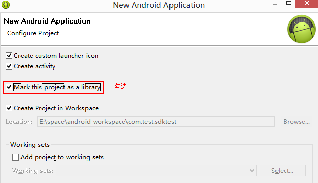
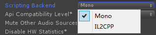
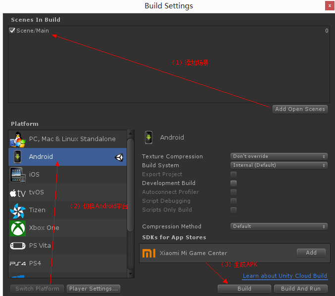

系统：Windows 8
引擎：Unity 2017.2.1f1

Android环境：
Android SDK：android-sdk_r24.4.1-windows
{
下载地址：
https://dl.google.com/android/android-sdk_r24.4.1-windows.zip?utm_source=androiddevtools&utm_medium=website
}
JDK：jdk-8u172-windows-x64
{
下载地址：
http://www.oracle.com/technetwork/java/javase/downloads/jdk8-downloads-2133151.html?utm_source=androiddevtools&utm_medium=website
}
Android IDE：adt-bundle-windows-x86_64-20140702
{
下载地址：
https://dl.google.com/android/adt/adt-bundle-windows-x86_64-20140702.zip?utm_source=androiddevtools&utm_medium=website
}
（以上Android工具是通过 http://www.androiddevtools.cn/ 找到的。）

安装完或解压完上面那堆工具，然后用android-sdk-windows里的SDK Manager.exe下载一些Tools和API，在本例中，API先挑两个本例所需的，Tools没懂，就全下了。

如下图：

 

本文用Unity原生插件（Native plugins）之一的Java插件来实现Unity3D与Android的互动，而Native plugins是平台专门的原生代码库，可以用来访问操作系统调用或者第三方的库。

首先用adt-bundle-windows里的eclipse新建一个Android工程：

 

新工程配置：

（1）

 

主题就不用了，选None，其实也可以用默认的，我多手而已。SDK选的就是刚用SDK Manager下的那两个API，这边的目标SDK要看Unity版本的默认目标SDK。而编译的就用低版本的，适应低版本Android OS的机子。

（2）勾选Mark this project as a library

 

（3）然后就一路Next，直到Finish。

为了把Unity的接口引入到Android工程，先在Android建一个lib目录，

然后把

Unity安装目录\Editor\Data\PlaybackEngines\AndroidPlayer\Variations\mono\Release\Classes下的classes.jar拉到Android工程里的lib目录下。

（题外话：也可以用

Unity安装目录\Editor\Data\PlaybackEngines\AndroidPlayer\Variations\il2cpp\Release\Classes

下的classes.jar，这看你是以什么方式打包，il2cpp还是mono，Unity默认mono的，这个配置在Unity的Play Settings的Other Settings里。

 

当然，il2cpp还要设置NDK，还没研究到，就用默认。）

再把classes.jar添加到引用库。

 

即：

 

然后编辑MainActivity.java，引入UnityPlayer和UnityPlayerActivity。为了不用Android的界面，就把onCreate函数的setContentView(R.layout.activity_main);这句去掉，再把onCreateOptionsMenu和onOptionsItemSelected两函数去掉，用不着。MainActivity改为继承UnityPlayerActivity，再去掉一些不用到的引用。加入一个供Unity回调的函数。

MainActivity.java具体代码：

```
package com.test.sdktest;

import com.unity3d.player.UnityPlayer;
import com.unity3d.player.UnityPlayerActivity;

import android.os.Bundle;
import android.widget.Toast;

public class MainActivity extends UnityPlayerActivity {

   @Override
   protected void onCreate(Bundle savedInstanceState) {
       super.onCreate(savedInstanceState);
    }

   public void CallFunc(String strMsg){
       Toast.makeText(this, strMsg, Toast.LENGTH_LONG).show();
       strMsg = strMsg + " & Android ---> Unity";
       String strObject = "Canvas";
       String strMethod = "Receive";
       UnityPlayer.UnitySendMessage(strObject, strMethod, strMsg);
    }

}
```

其中，UnityPlayer.UnitySendMessage是给Unity发送消息的接口，第一个参数是接收消息的脚本所绑定的对象名，第二个参数是接收消息的函数名，第三个参数是所发送到的消息。

而UnityPlayer.UnitySendMessage是Java插件的一个API，作用是从Java层把数据传递到C#。

然后把工程导出为JAR包。

 

打开Unity，先配置环境，Edit->Preferences的External Tools，配置SDK和JDK。

 

新建一个Unity工程，在Assets目录下新建Plugins/Android路径，在这目录下引入Android工程目录下的res目录、AndroidManifest.xml文件、还有刚生成的jar包。

在场景中拉个大按钮Button，由于用UGUI，Button上级有个Canvas，就给它加一个脚本，称为AndroidCommunicator，在里面加入一些与Android简单通信的接口。

C#具体代码：

```
using System;
using UnityEngine;
using UnityEngine.UI;

public class AndroidCommunicator :MonoBehaviour
{
    private AndroidJavaClass _AndroidCls;
    private AndroidJavaObject _AndroidObj;

    public Text m_Text;

    void Start()
    {
       _AndroidCls = new AndroidJavaClass("com.unity3d.player.UnityPlayer");
       _AndroidObj =_AndroidCls.GetStatic<AndroidJavaObject>("currentActivity");
    }

    public void Send()
    {
       _AndroidObj.Call("CallFunc", "Unity --->Android");
    }

    public void Receive(string str)
    {
       m_Text.text = str;
    }
}
```

此处通过Java插件的AndroidJavaClass和AndroidJavaObject接口来实现调用Android方法。

把Button的Text赋给AndroidCommunicator的m_Text。

 

Button的OnClick绑定到AndroidCommunicator的Send接口。

 

然后打开Player Settings（通过Build Settings打开，或者通过菜单Edit > Project Settings > Player打开）。

设置Company Name、Product Name、Package Name

 

 

在Build Settings添加场景，切换到Android平台，点击Build生成APK。

 

在手机上实测效果：

 

以上简单回顾。

参考资料：
http://www.cnblogs.com/msxh/p/7220741.html
https://blog.csdn.net/yang8456211/article/details/51331358
https://docs.unity3d.com/2017.2/Documentation/Manual/class-PlayerSettingsAndroid.html
http://www.xuanyusong.com/archives/676
https://blog.csdn.net/u014761712/article/details/50604865
