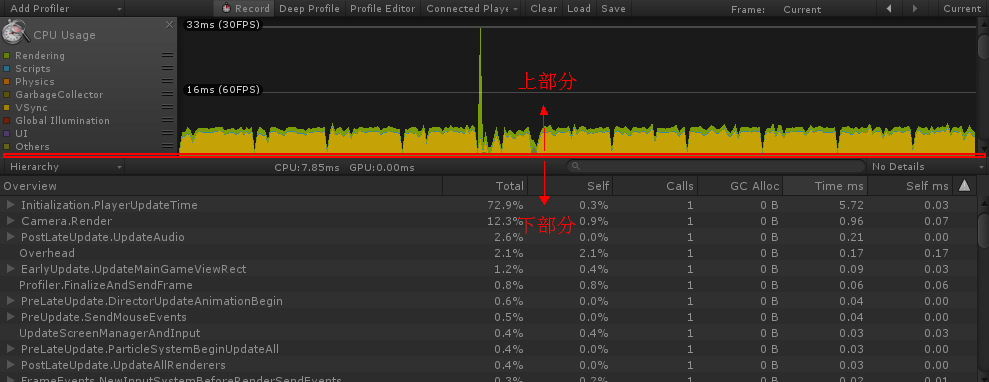
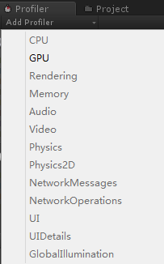
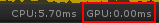
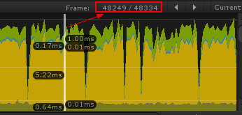
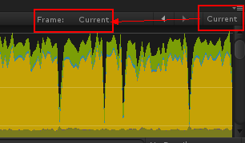
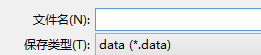
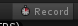
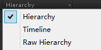
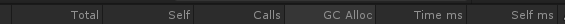
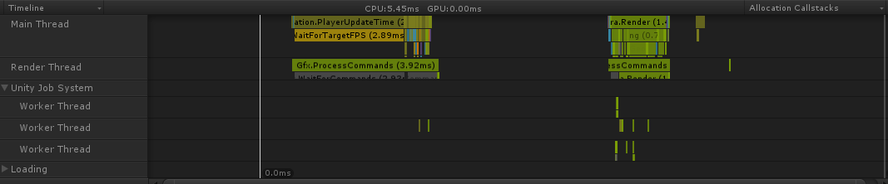

系统：Windows 7
引擎：Unity 5.6.5p4

Profiler分为上下两部分：

 

在上部分，最常用到CPU Usage Profiler，从中可以得到相当多的信息，有什么信息呢？
| Rendering           | 渲染当中，CPU损耗                    |
| ------------------- | ------------------------------------ |
| Scripts             | 用户自定义脚本产生的损耗             |
| Physics             | 物理碰撞的消耗                       |
| GarbageCollector    | GC嘛，就是堆上清除内存时产生的消耗   |
| VSync               | 垂直同步产生的损耗                   |
| Global Illumination | 全局照明（好像看过哪个版本是写成GI） |
| UI                  | 用户界面的消耗                       |
| Others              | 是啥？                               |

其实Profiler默认隐藏一个GPU Usage Profiler，可以通过Add Profiler添加。据说有些平台上调不出GPU Usage Profiler，大概就是这个原因，所以默认隐藏。

 

如果打开GPU Usage Profiler，则可以显示GPU的微秒数。

 

否则，GPU则会显示是0.00ms。

 

当前选中的第几帧：

 

而上部分选中的那一帧，也会在下部分同步，同时也会Pause掉正在运行的游戏，而因为这时BeginFrame和EndFrame没有改变，因此即使你取消Pause，让游戏继续运行，帧数据也不会有更新，所以要重新更新数据的话，就要点击Current。

 

Clear是清空帧数据，Save/Load是保存和载入帧数据。

 

数据的文件类型是.data，可以保存有价值的数据，以后再调出查看。

 

但载入过旧数据后，即使Current，也没法更新数据，因为需要激活一下Record。

 

在下部分，默认是Hierarchy，还有Timeline和Raw Hierarchy。

 

其中，Hierarchy与Raw Hierarchy一样的形式，现在不知道其区别，不过都有相同的数据。

 

| Total    | 消耗的总占比，包括子项     |
| -------- | -------------------------- |
| Self     | 自身的消耗占比，不包括子项 |
| Calls    | 被调用的次数               |
| GC Alloc | GC消耗的内存               |
| Time ms  | 总耗时，包括子项的耗时     |
| Self ms  | 自身耗时，不算上子项的耗时 |

通过点击任一项，可以用那一项作为排序，都是降序。

Timeline有主线程、渲染线程，还有在Unity工作系统下的Worker线程，这个Worker一般意义是处理任意工事的工作人员，但也有引申义是指处理特定工事的专职人员，在还没搞清意义前，这个就叫Worker线程好了。

 

以上简单回顾。

参考资料：
https://docs.unity3d.com/560/Documentation/Manual/ProfilerWindow.html
https://docs.unity3d.com/560/Documentation/Manual/ProfilerCPU.html
https://www.cnblogs.com/alan777/p/6115505.html

 