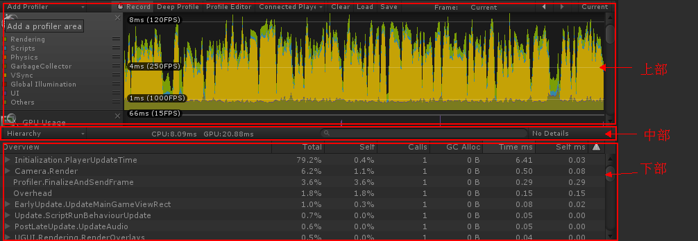

系统：Windows8
引擎：Unity 2017.2.1f1

选中帧率低的那一帧，然后在CPU Usage Profiler以Time ms排序。

本文把Profiler分为上中下三部分，如图：

（其实，中部是下部的标头，只是为了下面分析，而分出来。）

中部对比法：CPU与GPU的总ms作对比，谁值高谁受限，此方式只用于GPU Usage Profiler能打开的情况下（在[《Unity3D的Profiler》](https://blog.csdn.net/minami_takumi/article/details/81058941)有说明）；

下部对比法：Gfx.WairForPresent第一，CPU受限；

上部对比法：CPU Usage Profiler上方的Rendering高的话，CPU受限；

以上简单回顾。

参考资料：
http://www.cnblogs.com/alan777/p/6135703.html
