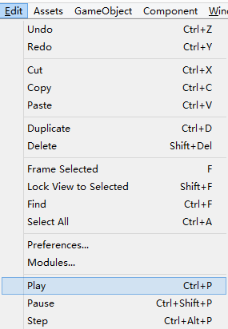

系统：Windows 8
引擎：Unity 2017.2.1f1

Unity3D使用Profiler进行性能分析有两种模式：Unity Editor与Development Build。

一、Unity Editor模式，玩虚的。

在Unity Editor中进行录制分析。

步骤如下：
1.首先新建或打开一个Unity3D工程。

2.打开Profiler窗口，有两种途经：
（1）菜单方式，Window > Profiler
  
（Ctrl+5也可以打开？不行！orz）

（2）添加页签方式，Add Tab -> Profiler
  

3.播放游戏，三种途经。
（1）菜单方式，Edit -> Play
  

（2）快捷键方式，Ctrl+P（如上图）

（3）点击播放按钮
  

然后就可以在Profiler窗口看到实时的分析数据。

二、Development Build模式，玩真的。

Development Build在目标平台上进行分析，需要运行development build并连接Profiler。不同的目标平台（例如：Windows, Android，OSX，iOS）有不同的具体做法。

步骤如下：
1．首先新建或打开一个Unity3D工程。

2．打开Profiler窗口（打开方式见上文：Unity Editor模式）

3．打开Build Settings，有两种途径：
（1）菜单方式，File > Build Settings
  

（2）快捷键方式，Ctrl+Shift+B

4．设置Build Settings

以Windows平台为例：
（1）转到Window平台（默认选择）
（2）添加需要加载的场景
（3）先勾选Development Build
（4）再勾选Autoconnect Profiler
上述步骤如下图：
  

以Android平台的连线方式为例：
（1）转到Android平台
  
（2）到（4）步，与Windows平台一致
（5）打开手机开发者模式
（6）打开手机USB调试

后面的步骤分为连线方式（编号为USB-X）和远程方式（需要手机先安装apk，编号为WiFi-X）：
（USB-7）然后在Profiler的Connected Player下拉菜单选择连接的手机
  

（WiFi-7）输入IP
  

（WiFi-8）输入IP后，点击Connect
  

（WiFi-9）Unity3D说：等着你回来~不回来就吞千支针哦~（卡死你！）
  

5．运行游戏（远程方式的没有这步），有三种方式：
（1）在Build Settings设置完后，直接点击Build and Run
  

（2）菜单方式，File -> Build & Run
  

（3）快捷键方式，Ctrl+B

然后就可以在Profiler窗口看到实时的分析数据。

以上简单回顾。

参考资料：
http://www.cnblogs.com/alan777/p/6135703.html 
https://blog.csdn.net/swj524152416/article/details/53466413
