系统：Windows8
引擎：Unity 2017.2.1f1
工具：
TexturePacker-4.8.2-x64
{
下载地址：
https://www.codeandweb.com/texturepacker
}
TexturePackerImporter-460.unitypackage (with Unity 2017.3)
{
下载页面：
https://www.codeandweb.com/blog/2017/12/21/hotfix-texturepacker-importer-unity-2017-3
下载地址：
https://www.codeandweb.com/public/texturepacker-importer/TexturePackerImporter-460.unitypackage
}

一、安装完TexturePacker之后，先选择试用专业版，但只活7天，续命方法如下：
（1）打开注册表，运行regedit
  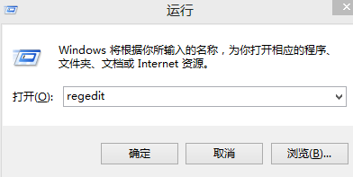

（2）把HKEY_CURRENT_USER\Software\code-and-web.de\TexturePacker\licensing目录里的trialExpired的值设置为false
  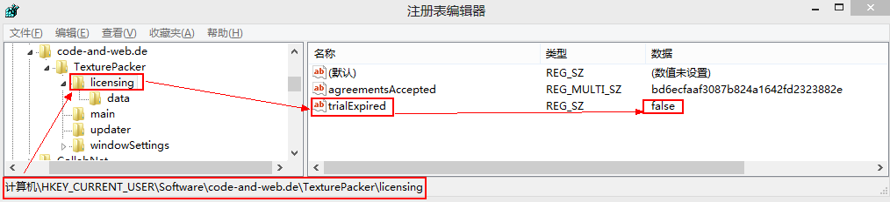

（3）再把子目录data里的expiryDate的值设置为2999-01-01
  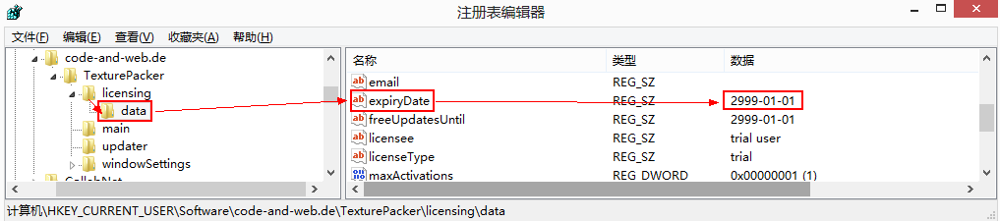

二、然后，制作图集，步骤如下：
（1）打开TextruePackerGUI.exe，然后把需要用到的图片拉进来
（2）选择Framework，此处选Unity – Texture2D sprite sheet
（3）选择Data file的路径和文件名，即图集文件和数据文件的路径
（4）点击Save project保存此图集工程
（5）点击Publish sprite sheet生成图集
  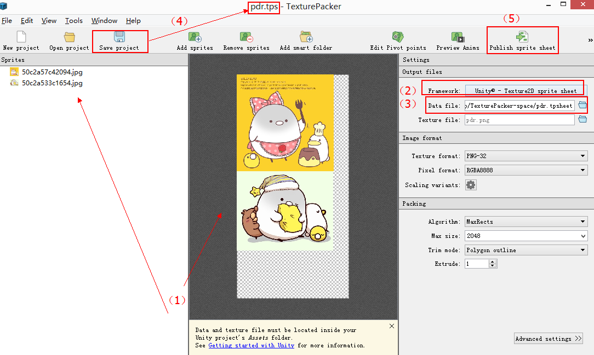


三、生成的图集应用到UGUI。
（1）打开unity工程
（2）把下载好的TexturePackerImporter-460.unitypackage拉进工程里，然后会在Assets下生成codeandweb.com目录
（3）在Assets目录下创建Resources目录，然后把刚生成的图集文件和数据文件拉进去
  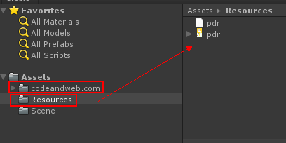

（4）对图集进行九宫格设置：
  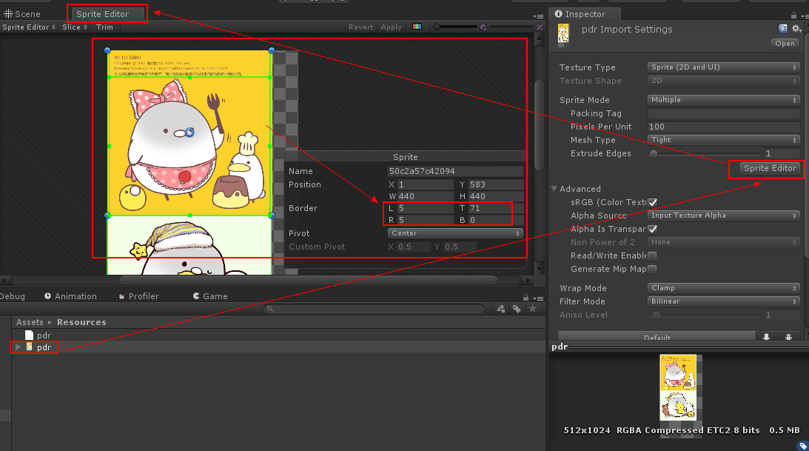

（5）界面布局如下：
  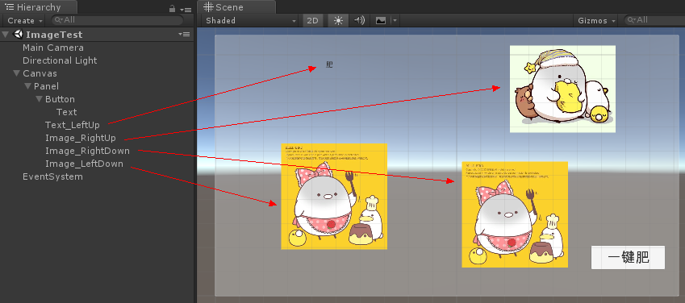

（6）把三个Image的ImageType属性分别设置为Tiled，Filled，Sliced。而设置为Filled的Image也要把FillMethod属性设置为Vertical。
<1>ImageType设置为Tiled
 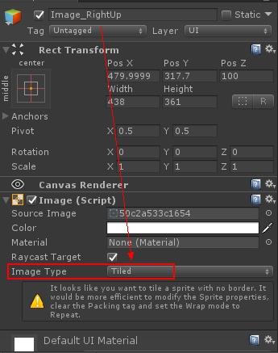

<2>ImageType设置为Filled
 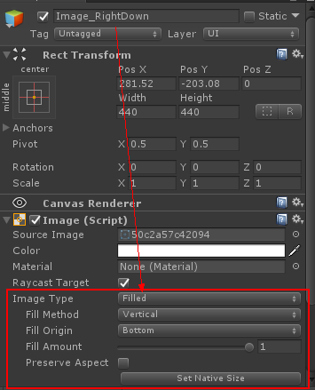

<3> ImageType设置为Sliced
 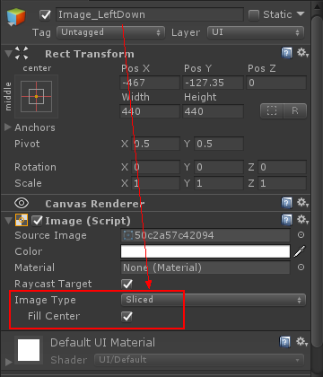

（7）给Panel添加脚本，代码如下：

```
using System.Collections;
using System.Collections.Generic;
using UnityEngine;
using UnityEngine.UI;

public class ImageController : MonoBehaviour {

    void OnClickFat()
    {
        // ImageType : Sliced
        string name = this.transform.name;
        Transform obj_LeftDown = this.transform.Find("Image_LeftDown");
        RectTransform rect_LeftDown = obj_LeftDown.GetComponent<RectTransform>();
        rect_LeftDown.sizeDelta = new Vector2(800, 800);

        // ImageType : Filled
        Transform obj_RightDown = this.transform.Find("Image_RightDown");
        Image image_RightDown = obj_RightDown.GetComponent<Image>();
        image_RightDown.fillAmount = 0.85f;

        // ImageType : Tiled
        Transform obj_RightUp = this.transform.Find("Image_RightUp");
        RectTransform rect_RightUp = obj_RightUp.GetComponent<RectTransform>();
        rect_RightUp.sizeDelta = new Vector2(800, 500);

        // Text...
        Transform obj_LeftUp = this.transform.Find("Text_LeftUp");
        Text rect_LeftUp = obj_LeftUp.GetComponent<Text>();
        rect_LeftUp.fontSize = 150;
    }
}
```

（8）Button绑定脚本的OnClickFat函数。
 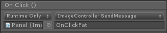

（9）最后，打成APK，显示为：
<1>肥前
 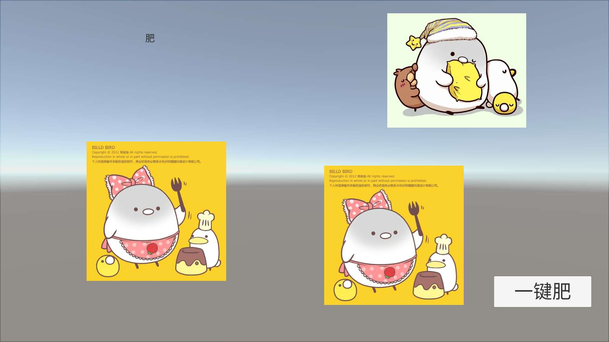

<2>肥后
 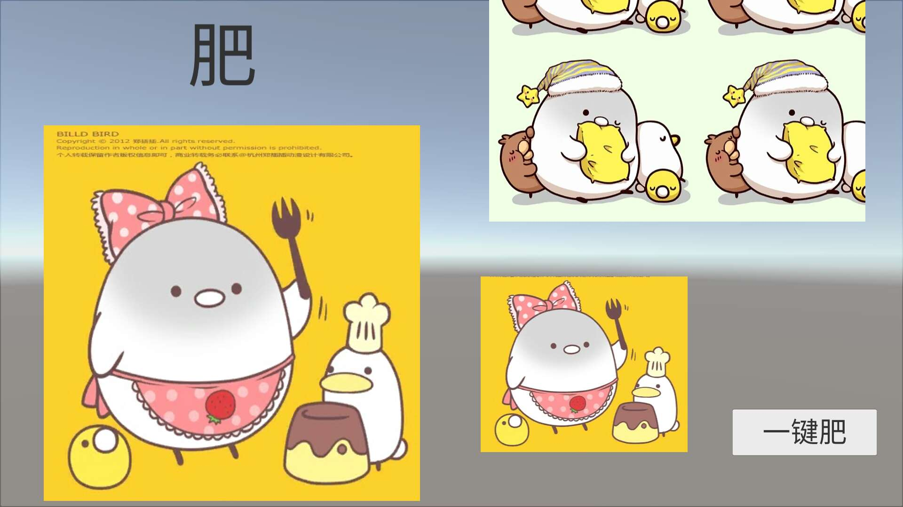


以上简单回顾。

参考资料：
https://bbs.pediy.com/thread-217931.htm
https://docs.unity3d.com/ScriptReference/UI.Image-fillAmount.html
