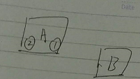
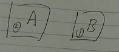
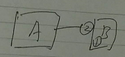
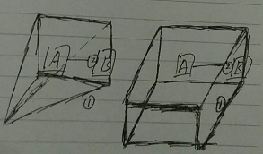

（1）有一个世界叫“世界坐标系”，这个世界的住民称为“物体坐标系”。

（2）故事出现两个住民，分别称为ObjectA和ObjectB。

（3）而ObjectA有两个挂件Pendant1和Pendant2，所以ObjectA是“嵌套坐标系”，属于这个世界的富人。

（4）某天，ObjectA带着两个挂件上街，在街上遇到ObjectB。
 

（5）ObjectB非常想要ObjectA的Pendant1，于是把Pendant1抢了过来。
 

（6）ObjectA非常愤怒，于是把手上的Pentant2砸向ObjectB。
 

（7）ObjectB被击飞，而此时，也被这个世界的神——“摄像机坐标系”看到。

（8）而这个世界的神又分为“投影摄像机坐标系”（Projection）和“正交摄像机坐标系”（Orthogonal）。

（9）刚才ObjectB抢的Pentant1，离开了ObjectB，掉落到世界上。

（10）但Projection视野不如Orthogonal宽，所以没看到。
 

（11）虽然Pentant1在ObjectB脱手后，才直接属于世界，但无论神或住民，又或者是他们的挂件，都直接或间接属于世界，所以“世界坐标系”才是最大的“嵌套坐标系”，最大的富人。

（12）The End

以上简单回顾。

参考资料：
《3D数学基础：图形与游戏开发》第3章
《Unity Shader入门精要》第4.6节
