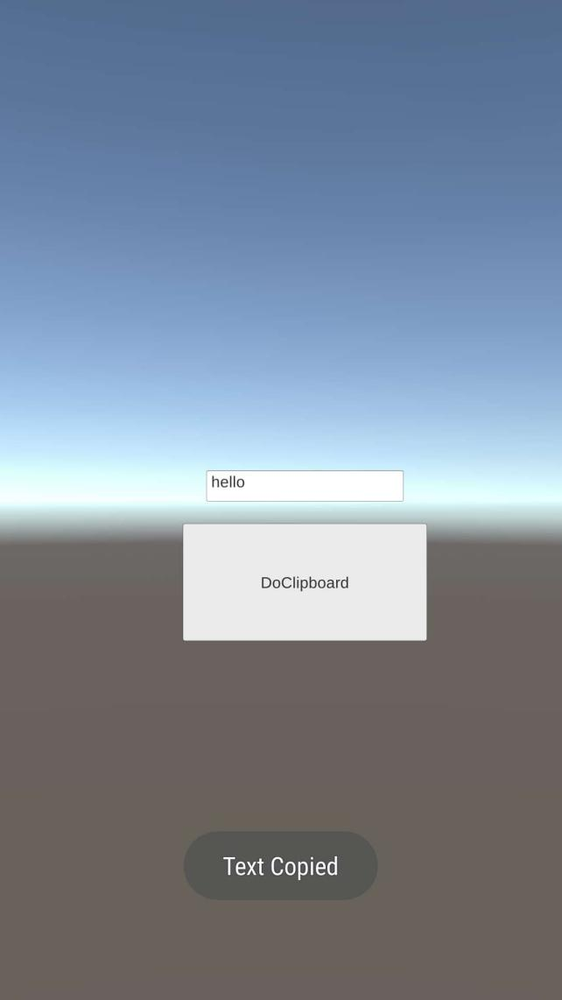

系统：Windows 10
引擎：Unity 5.6.6f2

Android环境与工程配置：参照[《Unity3D原生插件的应用之Unity3D与Android的互动》](https://blog.csdn.net/minami_takumi/article/details/81055390)

MainActivity.java具体代码：

```
package com.test.sdktest;

import com.unity3d.player.UnityPlayerActivity;

import android.os.Bundle;
import android.widget.Toast;

import android.content.ClipData;
import android.content.ClipboardManager;

public class MainActivity extends UnityPlayerActivity {
   @Override
   protected void onCreate(Bundle savedInstanceState) {
       super.onCreate(savedInstanceState);
    }

   /**剪贴板的函数
    * @param String
    */
   public void DoClipboard(String strContent) {
	   ClipboardManager clipboard = (ClipboardManager) this.getSystemService(MainActivity.CLIPBOARD_SERVICE);
	   ClipData clip = ClipData.newPlainText("data", strContent);
       clipboard.setPrimaryClip(clip);
       Toast.makeText(this, "Text Copied", Toast.LENGTH_SHORT).show();
   }
}
```


C#具体代码：

```
using System;
using UnityEngine;
using UnityEngine.UI;

public class AndroidCommunicator : MonoBehaviour
{
   private AndroidJavaClass _AndroidCls;
   private AndroidJavaObject _AndroidObj;
   
   public InputField m_Input;

    void Start()
    {
       _AndroidCls = new AndroidJavaClass("com.unity3d.player.UnityPlayer");
       _AndroidObj =_AndroidCls.GetStatic<AndroidJavaObject>("currentActivity");
    }
	
	public void OnClickClipboard()
    {
		_AndroidObj.Call("DoClipboard", m_Input.text);
    }

}
```

在手机上实测效果：


以上简单回顾。

参考资料：
https://www.cnblogs.com/xwwFrank/p/6020837.html
