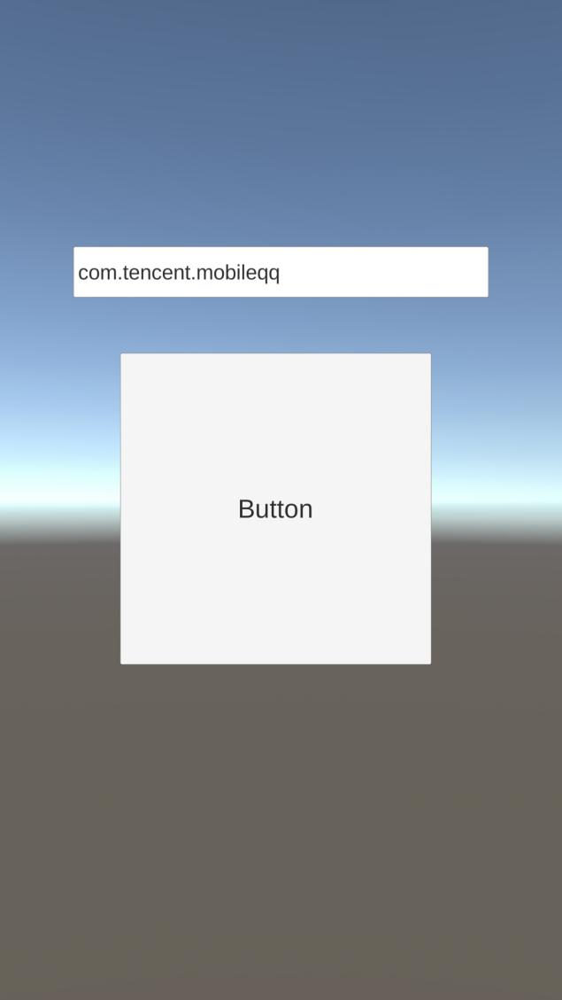

系统：Windows 10
引擎：Unity 5.6.6f2

Android环境与工程配置：参照[《Unity原生插件的应用之Unity与Android的互动》](https://blog.csdn.net/minami_takumi/article/details/81055390)

（1）Android的Intent组件有三种使用方式：
| 方式                   | 作用               |
| ---------------------- | ------------------ |
| 使用startActivity接口  | 启动另一个Activity |
| 使用startService接口   | 启动一个服务       |
| 使用sendBroadcasts接口 | 启动一个广播       |

（2）本例使用startActivity方式唤起手机QQ为例。

MainActivity.java具体代码：

```
package com.test.activeapp;

import com.unity3d.player.UnityPlayerActivity;

import android.content.Intent;
import android.content.pm.PackageInfo;
import android.content.pm.PackageManager;
import android.os.Bundle;
import android.widget.Toast;


public class MainActivity extends UnityPlayerActivity {

    @Override
    protected void onCreate(Bundle savedInstanceState) {
        super.onCreate(savedInstanceState);
    }
    
    /**
     * 唤起App
     * @param String
     */
    public void DoActiveApp(String packageName)
    {
	    PackageManager packageManager = getPackageManager();
	    if (checkAppExist(packageName)) {
	        Intent intent = packageManager.getLaunchIntentForPackage(packageName);
	        startActivity(intent);
	    } else {
	        Toast.makeText(MainActivity.this, packageName + "no exist", Toast.LENGTH_SHORT).show();
	    }
    }

    /**
     * 检查App是否已安装
     * @param String
     * @return boolean
     */
    private boolean checkAppExist(String packageName) {
        PackageInfo packageInfo = null;
        try {
            packageInfo = getPackageManager().getPackageInfo(packageName, 0);
        } catch (PackageManager.NameNotFoundException e) {
            e.printStackTrace();
        }
        return packageInfo != null;
    }
}
```


C#具体代码：

```
using System;
using UnityEngine;
using UnityEngine.UI;

public class AndroidCommunicator : MonoBehaviour
{
   private AndroidJavaClass _AndroidCls;
   private AndroidJavaObject _AndroidObj;
   
   public InputField m_Input;

    void Start()
    {
       _AndroidCls = new AndroidJavaClass("com.unity3d.player.UnityPlayer");
       _AndroidObj =_AndroidCls.GetStatic<AndroidJavaObject>("currentActivity");
	   m_Input.text = "com.tencent.mobileqq";
    }
	
	public void OnClickActiveApp()
    {
		_AndroidObj.Call("DoActiveApp", m_Input.text);
    }

}
```

在手机上实测效果：


可以在输入框改变包名，以作唤起不同App

以上简单回顾。

参考资料：

Android通过App启动另一个APP
https://www.jianshu.com/p/42ae7066f8f3

Intent详解
https://www.cnblogs.com/engine1984/p/4146621.html

Android总结篇——Intent机制详解及示例总结
https://www.cnblogs.com/X-knight/p/5438042.html
