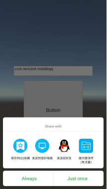

系统：Windows 10
引擎：Unity 5.6.6f2

Android环境与工程配置：参照[《Unity原生插件的应用之Unity与Android的互动》](https://blog.csdn.net/minami_takumi/article/details/81055390)

本文的截屏功能其实用的是Unity的API——Application.CaptureScreenshot，只有分享功能是调用Android。

以下例子以指定分享到手机QQ为例。

MainActivity.java具体代码：

```
package com.test.shotandshare;

import com.unity3d.player.UnityPlayerActivity;

import android.content.Intent;
import android.net.Uri;
import android.os.Bundle;

public class MainActivity extends UnityPlayerActivity {

    @Override
    protected void onCreate(Bundle savedInstanceState) {
        super.onCreate(savedInstanceState);
    }
	
	/*
	 * 分享
	 * @param String
	 */
	public void DoShare(String packageName, String pathName)
	{
		Uri uri = Uri.parse(pathName);
		Intent intent = new Intent();
		intent.setAction(Intent.ACTION_SEND);
		intent.setPackage(packageName);
		intent.setType("image/*");
		intent.putExtra(Intent.EXTRA_STREAM, uri);
        startActivity(intent);
	}
}
```


C#具体代码：

```
using System;
using System.Text;
using UnityEngine;
using UnityEngine.UI;

public class AndroidCommunicator : MonoBehaviour
{
    private AndroidJavaClass _AndroidCls;
    private AndroidJavaObject _AndroidObj;

    public InputField m_InputField;

    void Start()
    {
        _AndroidCls = new AndroidJavaClass("com.unity3d.player.UnityPlayer");
        _AndroidObj =_AndroidCls.GetStatic<AndroidJavaObject>("currentActivity");
        m_InputField.text = "com.tencent.mobileqq";
    }

    public void OnClickCapture()
    {
        String strFile = "shot.png";
        StringBuilder strPath = new StringBuilder(strFile);
        Application.CaptureScreenshot(strFile);

        strPath.Insert(0, "/");

        if (Application.platform == RuntimePlatform.Android || Application.platform == RuntimePlatform.IPhonePlayer)
        {
          strPath.Insert(0, Application.persistentDataPath);
        }
        else if (Application.platform==RuntimePlatform.WindowsPlayer)
        {
          strPath.Insert(0, Application.dataPath);
        }
        else if (Application.platform == RuntimePlatform.WindowsEditor)
        {
          strPath.Insert(0, Application.dataPath);
          strPath.Replace("/Assets",null);
        }

        _AndroidObj.Call("DoShare", m_InputField.text, strPath.ToString());
    }
}
```


在手机上实测效果：
 

可以在输入框改变包名，以作分享到其他App，如微信（理论上是这样，然而暂时实测只有QQ有效...）

以上简单回顾。

参考资料：
https://blog.csdn.net/dzc372787439/article/details/34099907
https://www.jianshu.com/p/0a0e2258b3d6
https://www.jianshu.com/p/25c84ed9046d

