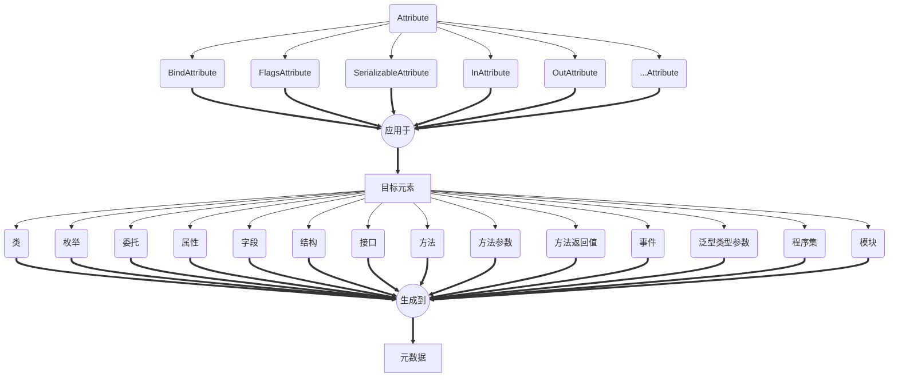
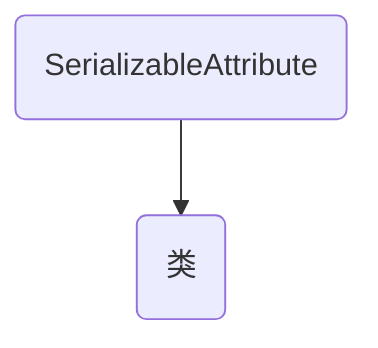
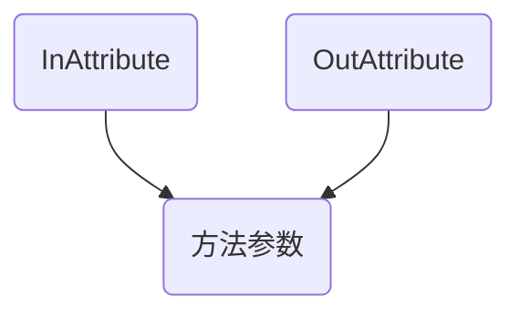

##  一、Attribute——目标元素——元数据

其中，

字段（Field）是指以readonly或static修饰的类成员。

属性（Property）是指以protected或private修饰，并且用get和set控制的类成员。

由于字段的安全性问题（存在public修饰的可能），一般只会给属性绑定特性。

## 二、Attribute与目标元素是存在一对一和多对一关系。

### （1）一对一：

### （2）多对一：

以上简单回顾。

参考资料： 

《CLR via C#(第3版)》第7.2节、第10.1.0节、第18.1节
