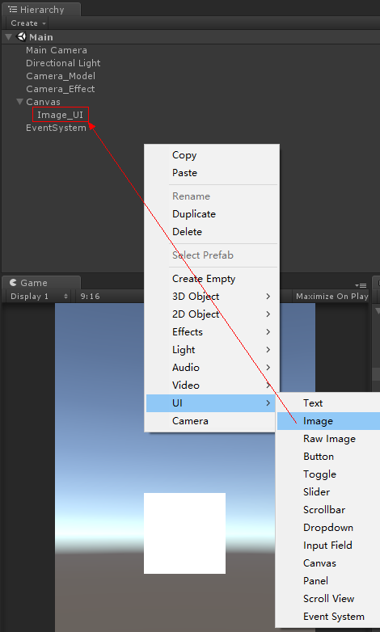

## 环境

> 系统：Windows 10
> 引擎：Unity 2017.2.1f1

## 目的
> 通过实例了解lCamera层级控制

## 实例
#### 一、布局主要分为三层：模型层、特效层、UI层。

（1-1）以两个Camera作为模型层和特效层的根节点。
 

（1-2）UI层的根节点默认为Canvas，通过生成UGUI控件（例如Image）时自动生成Canvas和EventSystem。
 

（1-3）在模型层（Camera_Model）下创建子控件：文本控件Text_Model、图片控件Image_Model、3D对象Capsule。
 

（1-4）在特效层（Camera_Effect）下创建子控件：图片控件Image_Effect、粒子控件Particle System。
 

#### 二、细化布局

（2-1）细化布局前，先添加两个层级（Model和Effect）以供分层管理。
 

（）
 

（）
 

（）
 

（）
 

（）
 

（）
 

（）
 

（）
 

（）
 

以上简单回顾。

## 参考资料：

无