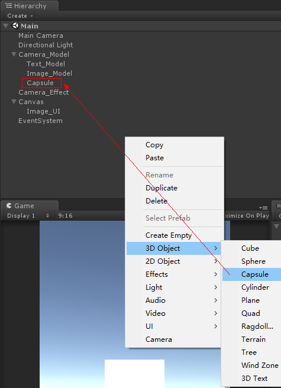
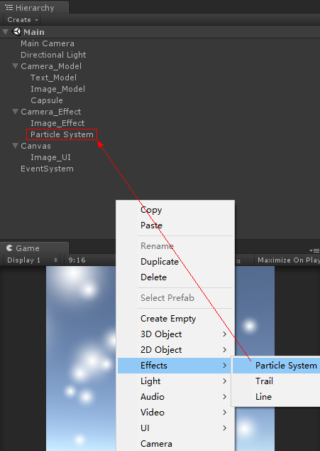

## 环境

> 系统：Windows 10
> 引擎：Unity 2017.2.1f1

## 目的
> 通过实例了解lCamera层级控制

## 实例
#### 一、布局主要分为三层：模型层、特效层、UI层。

（1-1）以两个Camera作为模型层和特效层的根节点。
 

（1-2）UI层的根节点默认为Canvas，通过生成UGUI控件（Image_UI）时自动生成Canvas和EventSystem。
 

（1-3）在模型层（Camera_Model）下创建子控件：文本控件Text_Model、图片控件Image_Model、3D对象Capsule。
 

（1-4）在特效层（Camera_Effect）下创建子控件：图片控件Image_Effect、粒子控件Particle System。
 

#### 二、调整各控件属性。

（2-1）调整各控件属性前，先添加两个层级（Model和Effect）以供分层管理。
 

（2-2）Camera_Model的属性设置如下：
 

（2-3）Text_Model的属性设置如下：
 

（2-4）Image_Model的属性设置如下：
 

（2-5）Capsule的属性设置如下：
 

（2-6）Camera_Effect的属性设置如下：
 

（2-7）Image_Effect的属性设置如下：
 

（2-8）Particle System的属性设置如下：
 

（2-9）Canvas的属性设置如下：
 

（2-10）Image_UI的属性设置如下：
 

（2-11）在Game窗口中可见通红的界面，显然这并非所想要的结果，而且明显是层级出了问题。
 

#### 三、通过Frame Debugger观察渲染过程。

（3-1）开启Frame Debugger窗口
 

（3-2）运行工程后，按下FrameDebugger窗口的Enable按钮，可见渲染过程。
 

（3-3）折叠渲染过程至主节点，此时可见剩下两个主节点。
 

（3-4）观察第一个主节点：
 

（3-5）观察第二个主节点：
 

（3-6）根据两个节点的情况，可知这是Image_UI的层级问题所导致，而Image_UI是源于Canvas的默认UGUI镜头。

#### 四、通过改变画布的默认渲染层级，以修正层级问题。

（4-1）
 

（4-2）
 

（4-3）
 

（4-4）
 

（4-）
 

以上简单回顾。

## 参考资料：

无